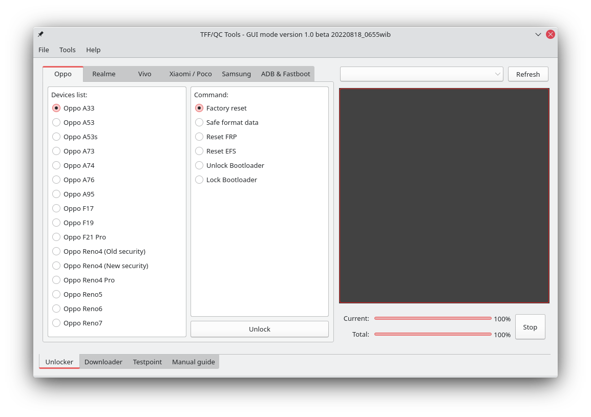
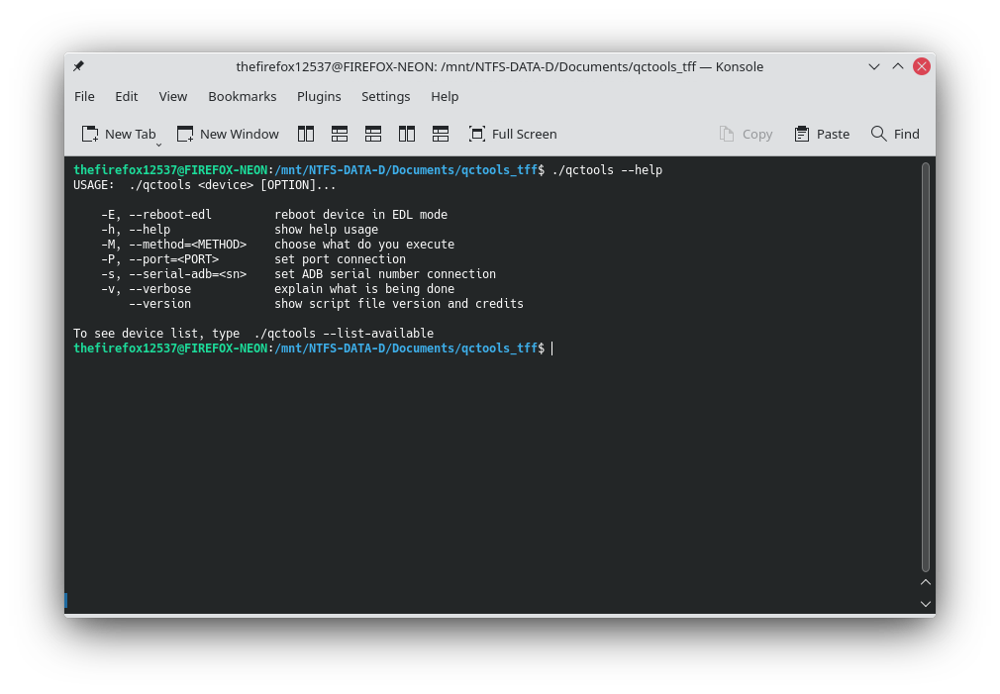

# TFF/QC Tools
Unlock and flash the Android phone device
 

## How to using this script:
```
$ ./qctools --help
USAGE:  ./qctools <device> [OPTION]...

    -E, --reboot-edl         reboot device in EDL mode
    -h, --help               show help usage
    -M, --method=<METHOD>    choose what do you execute
    -P, --port=<PORT>        set port connection
    -s, --serial-adb=<sn>    set ADB serial number connection
    -v, --verbose            explain what is being done
        --version            show script file version and credits

To see device list, type  ./qctools --list-available
```

List command:
```
$ ./qctools --method=help
Do erase or reset partition:
    userdata
    frp
    efs
    misc
    micloud
    unlock-bl
    relock-bl
```

Example:
```
$ ./qctools note5pro_whyred --method=micloud

Selected Model:    Xiaomi Redmi Note 5 Pro (Whyred)
Selected Brand:    Xiaomi
Operation:         Erase MiCloud

Error:  Qualcomm HS-USB port not detected.

```
```
$ ./qctools a53_cph2127 --method=frp

Selected Model:    Oppo A53 (CPH-2127)
Selected Brand:    Oppo/Realme
Operation:         Erase FRP

Error:  Qualcomm HS-USB port not detected.

```
```
$ ./qctools note8_ginkgo --reboot-edl

Selected Model:    Xiaomi Redmi Note 8 (Ginkgo)
Selected Brand:    Xiaomi
Operation:         Reboot to EDL mode

[ * ]   Rebooting device to EDL mode . . .
```

## Changelog:

See changelog [here](https://github.com/thefirefox12537/qctools_tff/blob/master/CHANGELOG)

## Credits:
```
$ ./qctools --version
TFF/QC Tools
Unlock and flash the Android phone devices.
Version report:  1.0 revision 2

This script developed by Faizal Hamzah [The Firefox Flasher].
Licensed under the MIT License.

Credits:
    [nijel8](https://github.com/nijel8)            Developer of emmcdl
    [bkerler](https://github.com/bkerler)           Developer of Qualcomm Firehose Attacker
    [Hari Sulteng](https://fb.com/haryflasher)      Owner of Qualcomm GSM Sulteng
    [Hadi Khoirudin](https://fb.com/f.hadikhoir)    Software engineer
```
